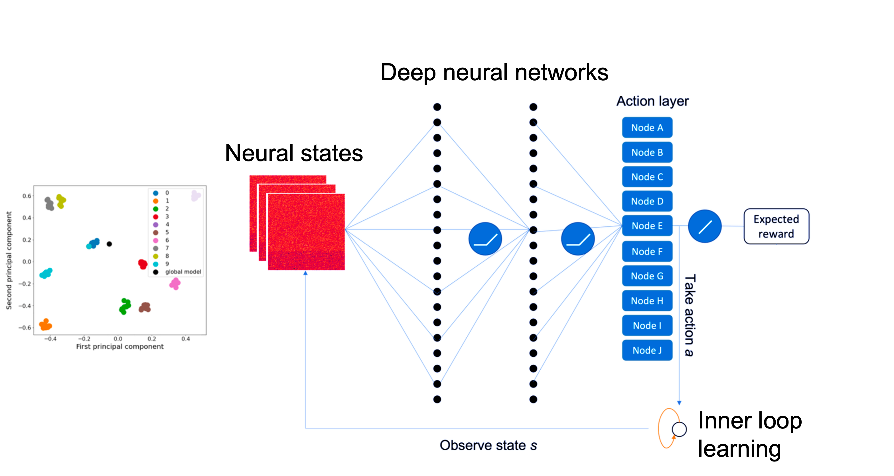

# Homogeneous-Learning
> A self-attention decentralized deep learning algorithm based on reinforcement learning.

## The Paper
[Homogeneous Learning: Self-Attention Decentralized Deep Learning](https://ieeexplore.ieee.org/document/9680704), Yuwei Sun and Hideya Ochiai, IEEE Access (2022).

## Table of Contents
* [General information](#general-information)
* [Setup instructions](#setup-instructions)
* [Running the systems](#running-the-systems)
* [Further readings](#further-readings)

## General information
Homogeneous Learning (HL) is a decentralized learning model for tackling non-IID data with a self-attention mechanism. HL leverages reinforcement learning (RL) to observe a node’s inner state and its surrounding environment’s state, and find out which node should be selected to optimize the training. Each node in HL has two neural network models, i.e., a node model which we call the local foundation model for a specific ML task and a RL model for the decision-making of model parameters sharing.

## Setup instructions
This is a quick guide to get started with the sources. 
### Dependencies 
You will need [Python 3](https://www.python.org/downloads/) and [Tensorflow 2](https://www.tensorflow.org/install/), to run the systems. 

Upgrade pip to the latest version, use:

    sudo python3 -m pip install --upgrade pip
    
Set up other modules and libraries dependencies, use:

    sudo pip3 install -r requirements.txt

### Forking or cloning
Consider ***forking*** the project if you want to make changes to the sources. If you simply want to run it locally, you can simply ***clone*** it.

#### Forking
If you decide to fork, follow the [instructions](https://help.github.com/articles/fork-a-repo) given by github. After that you can clone your own copy of the sources with:

    git clone https://github.com/YOUR_USER_NAME/homogeneous-learning.git

Make sure you change *YOUR_USER_NAME* to your user name.

## Running the systems
There are two components in HL, the decentralized learning system in the file of **"environment.py"**, and the DQN-based RL agent system in the file of **"node.py"**. More detailed information can be found in the **Section 3.3** of the Homogeneous Learning paper.

**"environment.py"** includes the decentralized learning algorithm, which allows the systems to envolve based on the decisions made by RL agents.

**"node.py"** includes the reinforcement learning algorithm for learning an optimized communication policy based on observations of model parameters and the correlated rewards.

The HL systems can be run from the terminal by simply typing:

    sudo python3 main.py
    
Note that **"main.py"** will include a total of 120 episodes' learning of how to train a local foundation model to achieve a desired goal within the minimum steps, and at the same time with less communication cost, where each episode includes a whole training procedure of the decentralized learning algorithm.

### Making changes
If you want to make changes to the source, such as the total episodes and the training goal, you are going to need to refer to the **Section 4.1, 4.2.1, A.2** in the paper for more information on how these components work with each other.

### Further readings
#### Reward-Based Model Learning 
* [The Consciousness Prior](https://arxiv.org/abs/1709.08568), Yoshua Bengio, arXiv preprint.
* [GFlowNet Foundations](https://arxiv.org/abs/2111.09266), Yoshua Bengio et al., arXiv preprint.

#### Decentralized ML
* [Decentralized Deep Learning for Multi-Access Edge Computing: A Survey on Communication Efficiency and Trustworthiness](https://www.techrxiv.org/articles/preprint/Decentralized_Deep_Learning_for_Multi-Access_Edge_Computing_A_Survey_on_Communication_Efficiency_and_Trustworthiness/16691230), Yuwei Sun et al., IEEE Transactions on Artificial Intelligence.  
